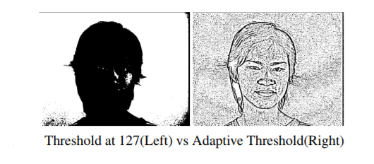
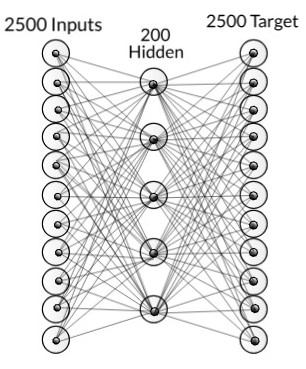

# Face-Recognition-using-Neural-Network
Recognize a face in an image using neural network

Dataset :- http://robotics.csie.ncku.edu.tw/Databases/FaceDetect_PoseEstimate.htm#Our_Database_

Dataset provided in this repository is has cropped faces in order to train. Original images can be found on the above link.
# Introduction
## Tools Used:-
 Python 3.6  
 Opencv 3.2.0  
 Numpy  
 Pillow  
 Pickle  
 gzib  

## Backpropogation
In artificial neural networks we use backpropagation to calculate a gradient that is needed in the calculation of the weights to be used in the network. This method is used to train deep neural networks i.e. networks with more than one hidden layer. It is equivalent to automatic differentiation in reverse accumulation mode. It requires the derivative of the loss function with respect to the network output to be known, which typically (but not necessarily) means that a desired target value is known. For this reason it is considered to be a supervised learning method.

## LVQ
LVQ stands for Learning Vector Quantization. It is a prototype-based supervised classification algorithm. LVQ is the supervised counterpart of vector quantization systems.

# Procedure

## Pre- Processing 
In the obtained database the image resolution is 680x480. If we take this as input then the total number of inputs will be 326,400 and we will be running it through multiple epoch which will take a lot of time and a lot computing power. Therefore to save time we decrease the resolution and take image size 50x50 and crop only the faces so that it gives us better results.

Each photo is converted to grey-scale. This gives us image in form of an array with value ranging from 0 to 255 in single array element. If we directly send this as input then again it will take a lot of time as well as value of weights will be very high so we set a threshold. If the value is above it then the cell value is +1 else -1.

If we take threshold 127 then with slight change in lighting the result can change drastically. So to avoid it we have use Adaptive Threshold Method(Gaussian).In Gaussian Adaptive Threshold, value is the weighted sum of neighbourhood values where weights are a Gaussian window.

  

## Training 

For training we have taken 1050 input images(650 positive and 400 negative images). For a single image we have 2500 input nodes which are then passed to 200 hidden nodes and finally there are 2500 output nodes.Target value for the BPN is given as the image itself. In this process BPN is used as auto-associative network. Here BPN is used to extract features of face from the image.

  
  Network with just BPN

After the network is trained then the hidden nodes are taken as input and pass on to another network in which it is separated by using LVQ. The output has two nodes which tells whether the face is present or not. This is passed to another layer which is then passed to a activation function. This is the final output which tells us the probability of face present in that image.
